# Relación de datos (diagrama ER)

Generado el 2026-09-16 a partir del esquema `public` del proyecto Supabase
(introspección por PostgREST). 94 tablas y 162 claves foráneas.

Convenciones:

- Cada tabla muestra su PK, sus FK y hasta 6 columnas más; el resto se resume
  como `mas_N_columnas`. La definición completa está en `db/migrations/`.
- Casi todas las tablas cuelgan de `stores` (`store_id`) o de `organizations`
  (`org_id`). Esas aristas se dibujan solo en el primer diagrama para no
  saturar los demás.
- Las tablas de otro dominio que participan en una relación aparecen como
  cajas reducidas (solo la PK).
- `||--o{` es uno a muchos; `||--o|` es uno a uno (la FK es también la PK).

## Vista general (núcleo)

Resumen de las tablas que sostienen la operación. Dos identidades mandan:
`orders` es el pedido tal como llegó de Shopify y `shipments` es cada salida
física de ese pedido. Todo lo comercial y financiero cuelga del pedido; todo lo
logístico cuelga de la salida.

- **`organizations` / `stores`**: la organización es el cliente de Kapta y agrupa
  tiendas. Casi toda tabla lleva `store_id`, y la RLS filtra por él.
- **`memberships` / `user_store_access`**: quién pertenece a qué organización y
  con qué rol, y a qué tiendas concretas puede entrar un `viewer`.
- **`orders`**: pedido de Shopify ingerido por webhook o cron. Es la única fuente
  de pedidos.
- **`order_master`**: fila desnormalizada del Master de Pedidos con el estado
  general y operativo que resuelve el MOM.
- **`order_events`**: historial de hechos del pedido o de una salida. Solo se
  agregan filas, nunca se sobrescriben.
- **`order_payments`** / **`order_sales`**: pagos y adelantos registrados y el
  cierre de venta uno a uno con el pedido.
- **`order_tasks`**: pendientes operativos que nacen de un evento.
- **`shipments`**: salida física con courier, guía y estado de rastreo. Puede
  apuntar a otra salida vía `fenix_shipment_id` cuando pasa por Fenix.
- **`leads` / `conversations` / `whatsapp_outbox`**: prospectos que llegan por
  WhatsApp, su conversación en Kapso y la cola de mensajes salientes. Un lead
  se enlaza al pedido cuando convierte.
- **`riders` / `delivery_routes` / `delivery_stops`**: reparto propio. Una ruta
  es el día de un rider y cada parada es una salida que debe entregar.
- **`dispatch_manifests` / `dispatch_manifest_items`**: manifiesto de despacho
  que agrupa salidas entregadas a un rider o courier, y cada ítem del mismo.
- **`rider_settlements` / `rider_settlement_lines`**: liquidación de lo cobrado
  por un rider y el detalle por pedido.
- **`logistics_providers` / `logistics_service_agreements` /
  `logistics_district_tariffs` / `logistics_requests`**: operadores 3PL, el
  acuerdo con cada tienda, la tarifa por distrito y la solicitud de servicio
  ligada a una salida.
- **`peru_districts`**: catálogo de distritos que sirve de clave a tarifas y
  coberturas.

```mermaid
erDiagram
  organizations {
    uuid id PK "Cliente de Kapta; agrupa tiendas"
  }
  stores {
    uuid id PK "Tienda Shopify; casi todo lleva store_id y la RLS filtra por el"
  }
  memberships {
    uuid user_id PK "Usuario en una organizacion y su rol"
  }
  user_store_access {
    uuid user_id PK "Tiendas concretas que puede ver un viewer"
  }
  orders {
    uuid id PK "Pedido ingerido de Shopify; unica fuente de pedidos"
  }
  order_master {
    uuid id PK "Fila del Master de Pedidos con estado general y operativo"
  }
  order_events {
    uuid id PK "Historial de hechos del pedido o salida; solo se agregan filas"
  }
  order_payments {
    uuid id PK "Pagos y adelantos registrados"
  }
  order_sales {
    uuid order_id PK "Cierre de venta, uno a uno con el pedido"
  }
  order_tasks {
    uuid id PK "Pendientes operativos que nacen de un evento"
  }
  shipments {
    uuid id PK "Salida fisica: courier, guia y rastreo"
  }
  leads {
    uuid id PK "Prospecto por WhatsApp; se enlaza al pedido al convertir"
  }
  conversations {
    uuid id PK "Conversacion del lead en Kapso"
  }
  whatsapp_outbox {
    uuid id PK "Cola de mensajes salientes de WhatsApp"
  }
  riders {
    uuid id PK "Repartidor propio"
  }
  delivery_routes {
    uuid id PK "Dia de ruta de un rider"
  }
  delivery_stops {
    uuid id PK "Parada: una salida que el rider debe entregar"
  }
  dispatch_manifests {
    uuid id PK "Manifiesto de salidas entregadas a un rider o courier"
  }
  dispatch_manifest_items {
    uuid id PK "Cada salida dentro del manifiesto"
  }
  rider_settlements {
    uuid id PK "Liquidacion de lo cobrado por un rider"
  }
  rider_settlement_lines {
    uuid id PK "Detalle de la liquidacion por pedido"
  }
  logistics_providers {
    uuid id PK "Operador logistico 3PL"
  }
  logistics_service_agreements {
    uuid id PK "Acuerdo del 3PL con una tienda"
  }
  logistics_district_tariffs {
    uuid id PK "Tarifa del 3PL por distrito"
  }
  logistics_requests {
    uuid id PK "Solicitud de servicio al 3PL ligada a una salida"
  }
  peru_districts {
    text district_key PK "Catalogo de distritos; clave de tarifas y coberturas"
  }
  organizations ||--o{ stores : org_id
  organizations ||--o{ memberships : org_id
  stores ||--o{ user_store_access : store_id
  stores ||--o{ orders : store_id
  stores ||--o{ leads : store_id
  stores ||--o{ conversations : store_id
  orders ||--o{ shipments : order_id
  orders ||--o{ order_master : order_id
  orders ||--o{ order_events : order_id
  orders ||--o{ order_payments : order_id
  orders ||--o{ order_tasks : order_id
  orders ||--o| order_sales : order_id
  orders ||--o{ leads : order_id
  shipments ||--o{ order_events : shipment_id
  shipments ||--o{ shipments : fenix_shipment_id
  shipments ||--o{ delivery_stops : shipment_id
  shipments ||--o{ dispatch_manifest_items : shipment_id
  shipments ||--o{ logistics_requests : shipment_id
  riders ||--o{ delivery_routes : rider_id
  delivery_routes ||--o{ delivery_stops : route_id
  delivery_routes ||--o{ dispatch_manifests : delivery_route_id
  dispatch_manifests ||--o{ dispatch_manifest_items : manifest_id
  riders ||--o{ rider_settlements : rider_id
  rider_settlements ||--o{ rider_settlement_lines : settlement_id
  logistics_providers ||--o{ logistics_service_agreements : provider_id
  logistics_service_agreements ||--o{ logistics_requests : agreement_id
  peru_districts ||--o{ logistics_district_tariffs : district_key
  leads ||--o{ whatsapp_outbox : lead_id
```



## Índice

- Vista general (núcleo)
- Acceso, tiendas e ingesta (16 tablas)
- Pedidos, pagos y Master (16 tablas)
- Leads y WhatsApp (11 tablas)
- Envíos y couriers externos (20 tablas)
- Reparto propio y liquidación de riders (13 tablas)
- Logística 3PL, tarifas y stock (11 tablas)
- Costos y publicidad (7 tablas)

## Acceso, tiendas e ingesta

Tablas: `organizations`, `stores`, `memberships`, `user_permissions`, `user_store_access`, `user_presence`, `whatsapp_numbers`, `sync_state`, `webhook_events`, `ops_snapshots`, `daily_rollups`, `ingest_anomalies`, `store_payment_methods`, `store_collection_accounts`, `quick_replies`, `shopify_product_images`.

```mermaid
erDiagram
  organizations {
    uuid id PK
    text name
  }
  stores {
    uuid id PK
    uuid org_id FK
    text name
    text shopify_domain
    text shopify_token_enc
    text shopify_webhook_secret_enc
    text kapso_project_id
    text kapso_api_key_enc
    text mas_72_columnas
  }
  memberships {
    uuid user_id PK
    uuid org_id PK FK
    text role
  }
  user_permissions {
    uuid user_id PK
    uuid org_id PK FK
    text permission PK
    boolean granted
    uuid granted_by
  }
  user_store_access {
    uuid user_id PK
    uuid store_id PK FK
  }
  user_presence {
    uuid user_id PK
    timestamptz last_seen_at
  }
  whatsapp_numbers {
    text phone_number_id PK
    text name
    text display_phone
    text kind
    timestamptz fetched_at
  }
  sync_state {
    uuid store_id PK FK
    text source PK
    text cursor
    timestamptz last_run_at
    text status
    text error
  }
  webhook_events {
    uuid id PK
    uuid store_id FK
    text topic
    text shopify_id
    text webhook_id
    timestamptz received_at
    boolean processed
    text error
  }
  ops_snapshots {
    uuid id PK
    uuid store_id FK
    timestamptz captured_at
    jsonb payload
  }
  daily_rollups {
    uuid store_id PK FK
    date date PK
    integer orders_count
    numeric revenue
    numeric aov
    integer conversations_count
    numeric conversion_rate
    integer promo_orders
    text mas_8_columnas
  }
  ingest_anomalies {
    uuid id PK
    uuid store_id FK
    date dia
    text source
    text reason
    integer count
    jsonb sample
    timestamptz first_seen_at
    text mas_1_columna
  }
  store_payment_methods {
    uuid id PK
    uuid store_id FK
    text kind
    text label
    text holder
    text account
    text detail
    boolean primary_yape
    text mas_2_columnas
  }
  store_collection_accounts {
    uuid id PK
    uuid store_id FK
    text label
    text_array aliases
    text phone_last_digits
    text note
    boolean active
  }
  quick_replies {
    uuid id PK
    uuid store_id FK
    text label
    text body
    integer sort
  }
  shopify_product_images {
    uuid store_id PK FK
    text product_id PK
    text image_url
    text image_alt
    text catalog_title
    timestamptz synced_at
  }
  organizations ||--o{ stores : org_id
  organizations ||--o{ memberships : org_id
  organizations ||--o{ user_permissions : org_id
  stores ||--o{ user_store_access : store_id
  stores ||--o{ sync_state : store_id
  stores ||--o{ webhook_events : store_id
  stores ||--o{ ops_snapshots : store_id
  stores ||--o{ daily_rollups : store_id
  stores ||--o{ ingest_anomalies : store_id
  stores ||--o{ store_payment_methods : store_id
  stores ||--o{ store_collection_accounts : store_id
  stores ||--o{ quick_replies : store_id
  stores ||--o{ shopify_product_images : store_id
```

## Pedidos, pagos y Master

Tablas: `orders`, `order_master`, `order_events`, `order_tasks`, `order_payments`, `order_sales`, `order_geo_overrides`, `draft_orders`, `flowcl_payment_links`, `yape_vision_checks`, `wa_auto_replies`, `wa_reply_templates`, `pickup_key_shares`, `pickup_key_views`, `shalom_order_drafts`, `shalom_pickup_keys`.

Referencias a otros dominios: `shipments`.

```mermaid
erDiagram
  orders {
    uuid id PK
    uuid store_id FK
    text shopify_order_id
    text name
    timestamptz processed_at
    numeric total_amount
    text currency
    text financial_status
    text mas_17_columnas
  }
  order_master {
    uuid id PK
    uuid store_id FK
    uuid order_id FK
    text order_name
    text shopify_order_id
    timestamptz order_created_at
    text customer_name
    text customer_phone
    text region
    text mas_51_columnas
  }
  order_events {
    uuid id PK
    uuid store_id FK
    uuid order_id FK
    uuid shipment_id FK
    text kind
    timestamptz occurred_at
    uuid actor
    text source
    text courier
    text guide_code
    text mas_11_columnas
  }
  order_tasks {
    uuid id PK
    uuid store_id FK
    uuid order_id FK
    uuid created_by_event_id FK
    text kind
    text status
    timestamptz due_at
    date due_on
    uuid assigned_to
    jsonb payload
    text mas_3_columnas
  }
  order_payments {
    uuid id PK
    uuid store_id FK
    uuid order_id FK
    text kind
    numeric amount
    text operation_number
    timestamptz paid_at
    text payer_name
    text payer_phone
    text mas_11_columnas
  }
  order_sales {
    uuid order_id PK FK
    uuid store_id FK
    uuid vendedora
    uuid lead_id
    timestamptz occurred_at
    text source
  }
  order_geo_overrides {
    uuid order_id PK FK
    uuid store_id FK
    text region
    text province
    text district
    text address
    text reference
    float8 latitude
    text mas_3_columnas
  }
  draft_orders {
    uuid id PK
    uuid store_id FK
    text shopify_draft_order_id
    text draft_order_gid
    text name
    text status
    timestamptz completed_at
    text invoice_url
    text mas_15_columnas
  }
  flowcl_payment_links {
    uuid id PK
    uuid store_id FK
    uuid order_id FK
    uuid payment_id FK
    text commerce_order
    text kind
    numeric amount
    text currency
    integer payment_method
    text flow_token
    text mas_9_columnas
  }
  yape_vision_checks {
    uuid id PK
    uuid store_id FK
    text message_id
    boolean is_voucher
    jsonb indicators
    text model
    timestamptz checked_at
  }
  wa_auto_replies {
    uuid id PK
    uuid store_id FK
    uuid order_id FK
    text inbound_message_id
    text phone
    text phone_number_id
    text trigger
    text body
    boolean ok
    text mas_2_columnas
  }
  wa_reply_templates {
    uuid id PK
    uuid store_id FK
    text label
    text template_name
    text language
    text body_preview
    text params
    boolean active
    text mas_1_columna
  }
  pickup_key_shares {
    uuid id PK
    uuid store_id FK
    uuid order_id FK
    uuid shared_by
    timestamptz shared_at
    text channel
    boolean confirmed
    text note
  }
  pickup_key_views {
    uuid id PK
    uuid store_id FK
    uuid order_id FK
    uuid user_id
    timestamptz viewed_at
    text ip
    text user_agent
    text reason
    jsonb payment_state
    text mas_1_columna
  }
  shalom_order_drafts {
    uuid order_id PK FK
    uuid store_id FK
    text document_type
    text document
    bigint destiny_terminal_id
    text destiny_terminal_name
    uuid updated_by
  }
  shalom_pickup_keys {
    uuid order_id PK FK
    uuid store_id FK
    text key_enc
    uuid created_by
    timestamptz replaced_at
    uuid replaced_by
  }
  shipments {
    uuid id PK
  }
  orders ||--o{ order_master : order_id
  orders ||--o{ order_events : order_id
  shipments ||--o{ order_events : shipment_id
  orders ||--o{ order_tasks : order_id
  order_events ||--o{ order_tasks : created_by_event_id
  orders ||--o{ order_payments : order_id
  orders ||--o| order_sales : order_id
  orders ||--o| order_geo_overrides : order_id
  orders ||--o{ flowcl_payment_links : order_id
  order_payments ||--o{ flowcl_payment_links : payment_id
  orders ||--o{ wa_auto_replies : order_id
  orders ||--o{ pickup_key_shares : order_id
  orders ||--o{ pickup_key_views : order_id
  orders ||--o| shalom_order_drafts : order_id
  orders ||--o| shalom_pickup_keys : order_id
```

## Leads y WhatsApp

Tablas: `leads`, `conversations`, `lead_calls`, `lead_experiments`, `lead_coverage_pushes`, `cart_seq_sends`, `drip_sends`, `winback_sends`, `whatsapp_outbox`, `chatby_webhook_log`, `meta_social_webhook_log`.

Referencias a otros dominios: `orders`.

```mermaid
erDiagram
  leads {
    uuid id PK
    uuid store_id FK
    uuid order_id FK
    text phone
    text wa_id
    text name
    text email
    timestamptz first_seen_at
    timestamptz last_interaction_at
    text mas_48_columnas
  }
  conversations {
    uuid id PK
    uuid store_id FK
    text kapso_conversation_id
    text phone_number_id
    timestamptz started_at
    text status
    integer message_count
    timestamptz last_message_at
    text mas_4_columnas
  }
  lead_calls {
    uuid id PK
    uuid lead_id FK
    uuid store_id FK
    uuid vendedora
    text kind
    text new_status
    text note
    timestamptz next_followup_at
    timestamptz occurred_at
  }
  lead_experiments {
    uuid lead_id PK FK
    text experiment PK
    uuid store_id FK
    text arm
    timestamptz assigned_at
  }
  lead_coverage_pushes {
    uuid lead_id PK FK
    text experiment PK
    uuid store_id FK
    timestamptz pushed_at
  }
  cart_seq_sends {
    uuid id PK
    uuid store_id FK
    uuid lead_id FK
    text phone
    text draft_order_gid
    text template_name
    integer touch
    boolean ok
    text error
    text mas_1_columna
  }
  drip_sends {
    uuid id PK
    uuid store_id FK
    uuid lead_id FK
    text phone
    text template_name
    integer touch
    boolean ok
    text error
    timestamptz sent_at
  }
  winback_sends {
    uuid id PK
    uuid store_id FK
    text phone
    text template_name
    text order_gid
    timestamptz sent_at
    boolean ok
  }
  whatsapp_outbox {
    uuid id PK
    uuid store_id FK
    uuid lead_id FK
    uuid retry_of FK
    text client_token
    text provider_message_id
    text phone_number_id
    text to_phone
    text kind
    text body
    text mas_8_columnas
  }
  chatby_webhook_log {
    uuid id PK
    timestamptz received_at
    text user_ns
    text_array header_names
    boolean parsed
    jsonb payload
  }
  meta_social_webhook_log {
    uuid id PK
    timestamptz received_at
    text object_type
    text_array entry_ids
    text_array fields
    text_array header_names
    boolean parsed
    text mas_1_columna
  }
  orders {
    uuid id PK
  }
  orders ||--o{ leads : order_id
  leads ||--o{ lead_calls : lead_id
  leads ||--o{ lead_experiments : lead_id
  leads ||--o{ lead_coverage_pushes : lead_id
  leads ||--o{ cart_seq_sends : lead_id
  leads ||--o{ drip_sends : lead_id
  leads ||--o{ whatsapp_outbox : lead_id
  whatsapp_outbox ||--o{ whatsapp_outbox : retry_of
```

## Envíos y couriers externos

Tablas: `shipments`, `shipment_calls`, `return_recovery_sends`, `shalom_transit_notifications`, `tanders_payment_checks`, `import_batches`, `import_rows`, `aliclik_agencies`, `aliclik_cod_points`, `aliclik_health_checks`, `aliclik_order_requests`, `aliclik_package_sizes`, `aliclik_sku_map`, `aliclik_skus`, `aliclik_sweep_state`, `aliclik_webhook_events`, `swayp_sku_map`, `district_coverage`, `peru_districts`, `shipments_status_backup_0108`.

Referencias a otros dominios: `orders`.

```mermaid
erDiagram
  shipments {
    uuid id PK
    uuid store_id FK
    uuid order_id FK
    uuid fenix_shipment_id FK
    uuid suggested_store_id FK
    text courier
    text guide_code
    text delivery_status
    text status_category
    boolean matched
    text match_method
    text mas_86_columnas
  }
  shipment_calls {
    uuid id PK
    uuid shipment_id FK
    uuid store_id FK
    uuid agent
    text kind
    text new_status
    text note
    timestamptz next_followup_at
    timestamptz occurred_at
    text mas_2_columnas
  }
  return_recovery_sends {
    uuid id PK
    uuid store_id FK
    uuid shipment_id FK
    text phone
    text template_name
    boolean ok
    text error
    uuid sent_by
    timestamptz sent_at
  }
  shalom_transit_notifications {
    uuid id PK
    uuid store_id FK
    uuid shipment_id FK
    uuid order_id FK
    text status
    integer attempts
    timestamptz next_attempt_at
    text phone
    text phone_number_id
    text template_name
    text mas_5_columnas
  }
  tanders_payment_checks {
    uuid id PK
    uuid shipment_id FK
    uuid store_id FK
    text image_url
    text state
    text_array reasons
    text recipient_name
    numeric amount
    text operation_number
    text mas_7_columnas
  }
  import_batches {
    uuid id PK
    uuid store_id FK
    text kind
    text filename
    uuid uploaded_by
    integer row_count
    integer matched_count
    integer unmatched_count
    text mas_11_columnas
  }
  import_rows {
    uuid id PK
    uuid batch_id FK
    uuid store_id FK
    uuid shipment_id FK
    integer row_index
    jsonb raw
    jsonb parsed
    text match_status
    text error
  }
  aliclik_agencies {
    uuid store_id PK FK
    text agency_id PK
    text name
    text address
    text department
    text province
    text district
    timestamptz synced_at
  }
  aliclik_cod_points {
    uuid org_id PK
    float8 lat PK
    float8 lng PK
  }
  aliclik_health_checks {
    uuid id PK
    uuid org_id FK
    timestamptz checked_at
    text status
    integer probes_total
    integer probes_ok
    integer latency_ms
    jsonb detail
  }
  aliclik_order_requests {
    uuid id PK
    uuid store_id FK
    uuid order_id FK
    text modality
    text status
    text order_number
    jsonb request
    jsonb response
    integer http_status
    text mas_4_columnas
  }
  aliclik_package_sizes {
    uuid store_id PK FK
    text title PK
    integer position
    timestamptz synced_at
  }
  aliclik_sku_map {
    uuid store_id PK FK
    text shopify_sku PK
    text ean
    text source
    text note
    uuid created_by
  }
  aliclik_skus {
    uuid store_id PK FK
    text ean PK
    text sku
    integer product_id
    text product_name
    text sku_name
    text category
    text url_image
    text mas_9_columnas
  }
  aliclik_sweep_state {
    uuid store_id PK FK
    timestamptz last_full_sweep_started_at
    timestamptz last_full_sweep_at
    timestamptz last_full_sweep_from
    timestamptz last_sweep_attempt_at
  }
  aliclik_webhook_events {
    uuid id PK
    uuid store_id FK
    text order_number
    text fingerprint
    text status
    text call_status
    text dispatch_status
    jsonb payload
    text mas_2_columnas
  }
  swayp_sku_map {
    uuid store_id PK FK
    text shopify_sku PK
    text codbar
    text nombre
    text note
    uuid created_by
  }
  district_coverage {
    uuid id PK
    uuid store_id FK
    text district
    text coverage
    text note
    uuid updated_by
  }
  peru_districts {
    text district_key PK
    text district
    text province
    text department
    text source
  }
  shipments_status_backup_0108 {
    uuid shipment_id PK FK
    text guide_code
    text prev_delivery_status
    text prev_status_category
    text prev_delivered_source
    text new_delivery_status
    timestamptz backed_up_at
  }
  orders {
    uuid id PK
  }
  orders ||--o{ shipments : order_id
  shipments ||--o{ shipments : fenix_shipment_id
  shipments ||--o{ shipment_calls : shipment_id
  shipments ||--o{ return_recovery_sends : shipment_id
  shipments ||--o{ shalom_transit_notifications : shipment_id
  orders ||--o{ shalom_transit_notifications : order_id
  shipments ||--o{ tanders_payment_checks : shipment_id
  import_batches ||--o{ import_rows : batch_id
  shipments ||--o{ import_rows : shipment_id
  orders ||--o{ aliclik_order_requests : order_id
  shipments ||--o| shipments_status_backup_0108 : shipment_id
```

## Reparto propio y liquidación de riders

Tablas: `riders`, `delivery_routes`, `delivery_stops`, `delivery_stop_events`, `dispatch_manifests`, `dispatch_manifest_items`, `dispatch_events`, `rider_pay_rates`, `rider_pay_adjustments`, `rider_daily_pay_closures`, `rider_settlements`, `rider_settlement_lines`, `rider_settlement_line_corrections`.

Referencias a otros dominios: `orders`, `peru_districts`, `shipments`.

```mermaid
erDiagram
  riders {
    uuid id PK
    uuid org_id FK
    uuid store_id FK
    text courier
    text full_name
    text doc_number
    text phone
    boolean active
    text note
    text mas_2_columnas
  }
  delivery_routes {
    uuid id PK
    uuid org_id FK
    uuid store_id FK
    uuid rider_id FK
    uuid settlement_id FK
    date route_date
    text status
    text note
    uuid created_by
    timestamptz started_at
    timestamptz closed_at
  }
  delivery_stops {
    uuid id PK
    uuid route_id FK
    uuid order_id FK
    uuid store_id FK
    uuid shipment_id FK
    uuid dispatch_manifest_id FK
    integer seq
    text status
    text payment_method
    numeric collected_amount
    text outcome_reason
    text note
    text mas_4_columnas
  }
  delivery_stop_events {
    uuid id PK
    uuid stop_id FK
    text status
    text payment_method
    numeric collected_amount
    text outcome_reason
    text note
    timestamptz occurred_at
    text mas_1_columna
  }
  dispatch_manifests {
    uuid id PK
    uuid org_id FK
    uuid rider_id FK
    uuid delivery_route_id FK
    text courier
    date route_date
    text route_label
    text driver_name
    text state
    uuid created_by
    text mas_10_columnas
  }
  dispatch_manifest_items {
    uuid id PK
    uuid manifest_id FK
    uuid shipment_id FK
    uuid store_id FK
    uuid added_by
    timestamptz added_at
    uuid office_checked_by
    timestamptz office_checked_at
    uuid pickup_checked_by
    timestamptz pickup_checked_at
    text mas_3_columnas
  }
  dispatch_events {
    uuid id PK
    uuid org_id FK
    uuid manifest_id FK
    uuid shipment_id FK
    uuid actor
    text kind
    jsonb payload
    timestamptz occurred_at
  }
  rider_pay_rates {
    uuid id PK
    uuid rider_id FK
    text district_key FK
    numeric amount
    date effective_from
    text reason
    uuid created_by
  }
  rider_pay_adjustments {
    uuid id PK
    uuid route_id FK
    uuid stop_id FK
    uuid reverses_id FK
    numeric amount
    text reason
    uuid approved_by
    timestamptz approved_at
  }
  rider_daily_pay_closures {
    uuid route_id PK FK
    jsonb snapshot
    uuid approved_by
    timestamptz approved_at
  }
  rider_settlements {
    uuid id PK
    uuid org_id FK
    uuid store_id FK
    uuid rider_id FK
    uuid route_id FK
    text rider_name_raw
    date settlement_date
    text source
    text file_path
    text file_sha256
    numeric declared_cash
    text mas_10_columnas
  }
  rider_settlement_lines {
    uuid id PK
    uuid settlement_id FK
    uuid order_id FK
    text guide_code
    text order_name
    text declared_status
    numeric declared_amount
    text match_status
    jsonb raw
    text mas_5_columnas
  }
  rider_settlement_line_corrections {
    uuid id PK
    uuid settlement_id FK
    uuid line_id FK
    text field_name
    numeric previous_value
    numeric new_value
    text reason
    uuid created_by
  }
  orders {
    uuid id PK
  }
  peru_districts {
    text district_key PK
  }
  shipments {
    uuid id PK
  }
  riders ||--o{ delivery_routes : rider_id
  rider_settlements ||--o{ delivery_routes : settlement_id
  delivery_routes ||--o{ delivery_stops : route_id
  orders ||--o{ delivery_stops : order_id
  shipments ||--o{ delivery_stops : shipment_id
  dispatch_manifests ||--o{ delivery_stops : dispatch_manifest_id
  delivery_stops ||--o{ delivery_stop_events : stop_id
  riders ||--o{ dispatch_manifests : rider_id
  delivery_routes ||--o{ dispatch_manifests : delivery_route_id
  dispatch_manifests ||--o{ dispatch_manifest_items : manifest_id
  shipments ||--o{ dispatch_manifest_items : shipment_id
  dispatch_manifests ||--o{ dispatch_events : manifest_id
  shipments ||--o{ dispatch_events : shipment_id
  riders ||--o{ rider_pay_rates : rider_id
  peru_districts ||--o{ rider_pay_rates : district_key
  delivery_routes ||--o{ rider_pay_adjustments : route_id
  delivery_stops ||--o{ rider_pay_adjustments : stop_id
  rider_pay_adjustments ||--o{ rider_pay_adjustments : reverses_id
  delivery_routes ||--o| rider_daily_pay_closures : route_id
  riders ||--o{ rider_settlements : rider_id
  delivery_routes ||--o{ rider_settlements : route_id
  rider_settlements ||--o{ rider_settlement_lines : settlement_id
  orders ||--o{ rider_settlement_lines : order_id
  rider_settlements ||--o{ rider_settlement_line_corrections : settlement_id
  rider_settlement_lines ||--o{ rider_settlement_line_corrections : line_id
```

## Logística 3PL, tarifas y stock

Tablas: `logistics_providers`, `logistics_service_agreements`, `logistics_district_tariffs`, `logistics_fee_rules`, `logistics_district_availability_events`, `logistics_requests`, `logistics_request_events`, `inventory_pools`, `inventory_pool_store_access`, `fenix_stock`, `fenix_stock_movements`.

Referencias a otros dominios: `orders`, `peru_districts`, `shipments`.

```mermaid
erDiagram
  logistics_providers {
    uuid id PK
    uuid org_id FK
    text code
    text name
    text legal_name
    text status
    text coverage_note
    time same_day_cutoff
    text mas_4_columnas
  }
  logistics_service_agreements {
    uuid id PK
    uuid provider_id FK
    uuid client_org_id FK
    uuid store_id FK
    text client_label
    text status
    text assignment_mode
    text settlement_frequency
    time same_day_cutoff
    text coverage_note
    text mas_4_columnas
  }
  logistics_district_tariffs {
    uuid id PK
    uuid provider_id FK
    uuid agreement_id FK
    text district_key FK
    text zone
    numeric delivery_amount
    numeric rejection_amount
    boolean includes_igv
    text currency
    date effective_from
    text mas_4_columnas
  }
  logistics_fee_rules {
    uuid id PK
    uuid provider_id FK
    uuid agreement_id FK
    text kind
    numeric percentage
    date effective_from
    date effective_to
    text status
    text note
    text mas_1_columna
  }
  logistics_district_availability_events {
    uuid id PK
    uuid provider_id FK
    uuid agreement_id FK
    text district_key FK
    text action
    text reason
    date paused_until
    uuid created_by
  }
  logistics_requests {
    uuid id PK
    uuid provider_id FK
    uuid agreement_id FK
    uuid store_id FK
    uuid order_id FK
    uuid shipment_id FK
    text district_key FK
    uuid tariff_id FK
    text source
    text external_reference
    text idempotency_key
    text status
    numeric tariff_amount
    text currency
    text mas_7_columnas
  }
  logistics_request_events {
    uuid id PK
    uuid request_id FK
    text kind
    text status
    uuid actor
    text note
    jsonb payload
    timestamptz occurred_at
  }
  inventory_pools {
    uuid id PK
    uuid custodian_provider_id FK
    uuid owner_org_id FK
    text code
    text name
    text owner_label
    boolean strict_control
    text status
    text note
    text mas_1_columna
  }
  inventory_pool_store_access {
    uuid pool_id PK FK
    uuid store_id PK FK
    boolean active
    uuid created_by
  }
  fenix_stock {
    uuid id PK
    uuid org_id FK
    text city
    text product
    text sku
    integer quantity
    uuid updated_by
    boolean unlimited
  }
  fenix_stock_movements {
    uuid id PK
    uuid org_id FK
    uuid fenix_stock_id FK
    uuid shipment_id FK
    text city
    text product
    text kind
    integer delta
    integer balance_after
    text note
    text mas_1_columna
  }
  orders {
    uuid id PK
  }
  peru_districts {
    text district_key PK
  }
  shipments {
    uuid id PK
  }
  logistics_providers ||--o{ logistics_service_agreements : provider_id
  logistics_providers ||--o{ logistics_district_tariffs : provider_id
  logistics_service_agreements ||--o{ logistics_district_tariffs : agreement_id
  peru_districts ||--o{ logistics_district_tariffs : district_key
  logistics_providers ||--o{ logistics_fee_rules : provider_id
  logistics_service_agreements ||--o{ logistics_fee_rules : agreement_id
  logistics_providers ||--o{ logistics_district_availability_events : provider_id
  logistics_service_agreements ||--o{ logistics_district_availability_events : agreement_id
  peru_districts ||--o{ logistics_district_availability_events : district_key
  logistics_providers ||--o{ logistics_requests : provider_id
  logistics_service_agreements ||--o{ logistics_requests : agreement_id
  orders ||--o{ logistics_requests : order_id
  shipments ||--o{ logistics_requests : shipment_id
  peru_districts ||--o{ logistics_requests : district_key
  logistics_district_tariffs ||--o{ logistics_requests : tariff_id
  logistics_requests ||--o{ logistics_request_events : request_id
  logistics_providers ||--o{ inventory_pools : custodian_provider_id
  inventory_pools ||--o{ inventory_pool_store_access : pool_id
  fenix_stock ||--o{ fenix_stock_movements : fenix_stock_id
  shipments ||--o{ fenix_stock_movements : shipment_id
```

## Costos y publicidad

Tablas: `product_costs`, `cost_tariffs`, `additional_costs`, `ad_products`, `ad_product_declarations`, `meta_ads`, `meta_ad_insights_daily`.

```mermaid
erDiagram
  product_costs {
    uuid id PK
    uuid org_id FK
    uuid store_id FK
    text sku
    text product_name
    text supplier
    text batch
    numeric unit_cost
    text currency
    text mas_4_columnas
  }
  cost_tariffs {
    uuid id PK
    uuid org_id FK
    uuid store_id FK
    text courier
    text region
    text province
    text district
    text concept
    numeric amount
    text mas_6_columnas
  }
  additional_costs {
    uuid id PK
    uuid org_id FK
    uuid store_id FK
    text concept
    text label
    numeric amount
    text currency
    text basis
    date effective_from
    text mas_3_columnas
  }
  ad_products {
    uuid id PK
    uuid store_id FK
    text ad_id
    text ad_headline
    text suggested_label
    smallint evidence_pct
    integer evidence_sample
  }
  ad_product_declarations {
    uuid id PK
    uuid store_id FK
    text ad_id
    text product_handle
    timestamptz valid_from
    text note
    uuid declared_by
    timestamptz declared_at
  }
  meta_ads {
    text ad_id PK
    text account_id
    text campaign_id
    text campaign_name
    text objective
    text adset_id
    text adset_name
    text mas_6_columnas
  }
  meta_ad_insights_daily {
    uuid store_id PK FK
    text account_id PK
    date date PK
    text ad_id PK
    text account_name
    text currency
    text campaign_id
    text campaign_name
    text adset_id
    text adset_name
    text mas_13_columnas
  }
```

## Tablas que cuelgan de `stores` y `organizations`

Con `store_id` → `stores` (66): `ad_product_declarations`, `ad_products`, `additional_costs`, `aliclik_agencies`, `aliclik_order_requests`, `aliclik_package_sizes`, `aliclik_sku_map`, `aliclik_skus`, `aliclik_sweep_state`, `aliclik_webhook_events`, `cart_seq_sends`, `conversations`, `cost_tariffs`, `daily_rollups`, `delivery_routes`, `delivery_stops`, `dispatch_manifest_items`, `district_coverage`, `draft_orders`, `drip_sends`, `flowcl_payment_links`, `import_batches`, `import_rows`, `ingest_anomalies`, `inventory_pool_store_access`, `lead_calls`, `lead_coverage_pushes`, `lead_experiments`, `leads`, `logistics_requests`, `logistics_service_agreements`, `meta_ad_insights_daily`, `ops_snapshots`, `order_events`, `order_geo_overrides`, `order_master`, `order_payments`, `order_sales`, `order_tasks`, `orders`, `pickup_key_shares`, `pickup_key_views`, `product_costs`, `quick_replies`, `return_recovery_sends`, `rider_settlements`, `riders`, `shalom_order_drafts`, `shalom_pickup_keys`, `shalom_transit_notifications`, `shipment_calls`, `shipments`, `shopify_product_images`, `store_collection_accounts`, `store_payment_methods`, `swayp_sku_map`, `sync_state`, `tanders_payment_checks`, `user_store_access`, `wa_auto_replies`, `wa_reply_templates`, `webhook_events`, `whatsapp_outbox`, `winback_sends`, `yape_vision_checks`.

Con `org_id` → `organizations` (17): `additional_costs`, `aliclik_health_checks`, `cost_tariffs`, `delivery_routes`, `dispatch_events`, `dispatch_manifests`, `fenix_stock`, `fenix_stock_movements`, `inventory_pools`, `logistics_providers`, `logistics_service_agreements`, `memberships`, `product_costs`, `rider_settlements`, `riders`, `stores`, `user_permissions`.

Sin FK a ninguna tabla (catálogos, logs y estado por usuario): `aliclik_cod_points`, `chatby_webhook_log`, `meta_ads`, `meta_social_webhook_log`, `organizations`, `peru_districts`, `user_presence`, `whatsapp_numbers`.
